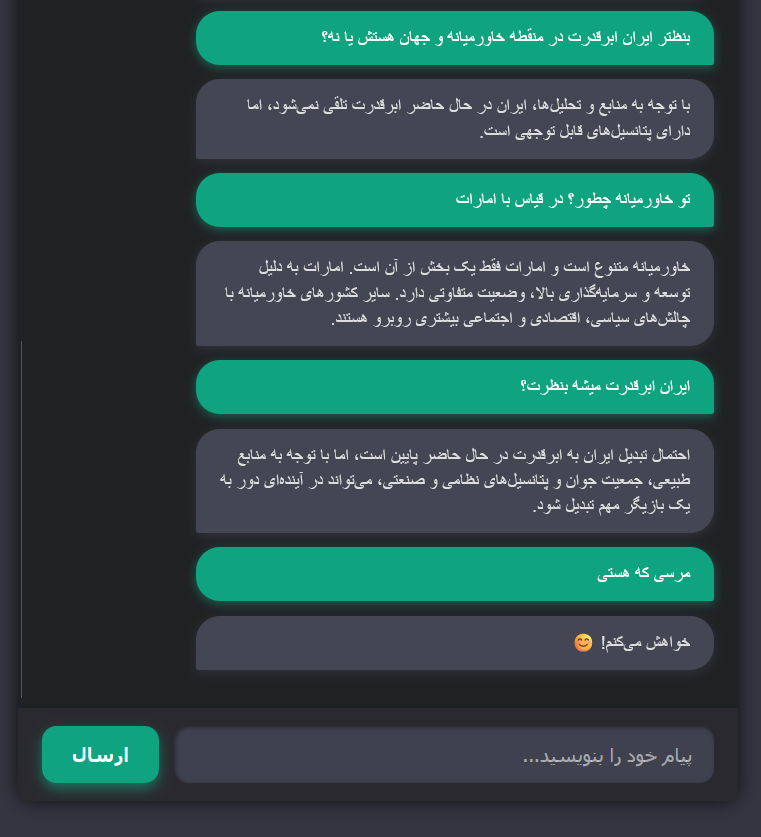

## Persian RAG Chatbot
A Persian-language chatbot powered by Retrieval‑Augmented Generation (RAG) using FastAPI, SentenceTransformers, SQLite, and local LLMs via Ollama, with streaming responses (SSE) and a simple web UI.



### Features
- Persian language support
- Semantic search with Sentence Embeddings
- RAG‑based answer generation
- Streaming responses (Server‑Sent Events)
- SQLite knowledge base
- Local LLM inference using Ollama
- Simple HTML/CSS/JS UI
- FastAPI backend

### Tech Stack
- Backend: FastAPI, Uvicorn
- Embeddings: sentence-transformers (all-MiniLM-L6-v2)
- Database: SQLite
- LLM Runtime: Ollama
- Frontend: HTML, CSS, JavaScript
- Streaming: SSE (text/event-stream)

### Requirements
- Python 3.10+
- Ollama installed and running
- A local LLM model (gemma3:4b):

```
ollama pull gemma3:4b
```
### Installation
Create virtual environment
```
python -m venv chatbot_env
```
Activate it:

Windows

```
chatbot_env\Scripts\activate
```
Linux / macOS

```
source chatbot_env/bin/activate
```
### Install dependencies
```
pip install -r requirements.txt
```
### Knowledge Base Preparation
Place your YAML knowledge files (e.g. Persian conversations) in a directory and run:

```
python load_corpus_to_sqlite.py
```
This will:

- Parse YAML conversations
- Generate embeddings
- Store them in SQLite

### Running the Application
```
python main.py
```
The app will be available at:

```
http://127.0.0.1:8000
```
### API Endpoints

```
GET /

```
Returns the frontend UI.

```
POST /api/chat

```
Request Body
```
json
{
  "message": "سلام"
}
```
Response : 
```
...
```

### Streamed text (text/event-stream)
How It Works (RAG Flow)
- User message received
- Sentence embedding generated
- Cosine similarity search in SQLite
- If similarity > threshold → RAG context is used
Otherwise → fallback to pure LLM
- Response streamed token‑by‑token via SSE
### Ollama Configuration

In bot.py:

python
```
url = "http://localhost:11434/api/generate"
```
amnd 
```
model = "gemma3:4b"
```
### You can replace the model with:
```
qwen2.5
llama3
mistral
```
any Ollama‑supported model

### Frontend
Located in:

```
static/
```
Uses vanilla JavaScript to consume streaming SSE responses from FastAPI.

### Future Improvements
- Chat history memory
- Admin UI for knowledge management
- Multi‑user support
- Hybrid vector + keyword search

The Project is just a test and still is under improvement.